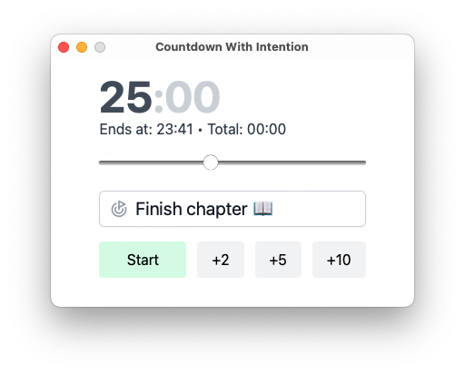
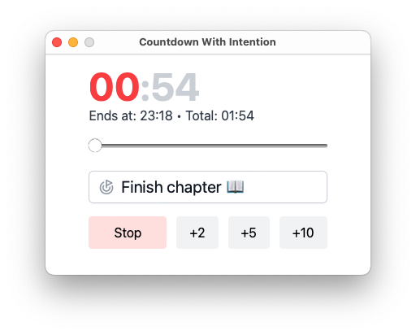

# Countdown With Intention

Countdown timer with intention.  
Set the time.  
Add your intention, e.g. "Finish chapter 📖".  
See the end time of the countdown.  
Start the countdown.  
See the total elapsed time.  
Hear 1 beep when 1 minute left.  
Hear 2 beeps when 30 seconds left.  
Hear 3 beeps at the end of countdown.
See counting up time after countdown reaches zero.  
Hear 1 beep every 30 negative seconds.  
Copies details of stopped countdown to clipboard in iCal format.  

**Screenshot**  

